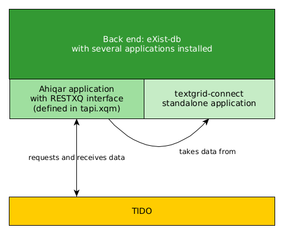
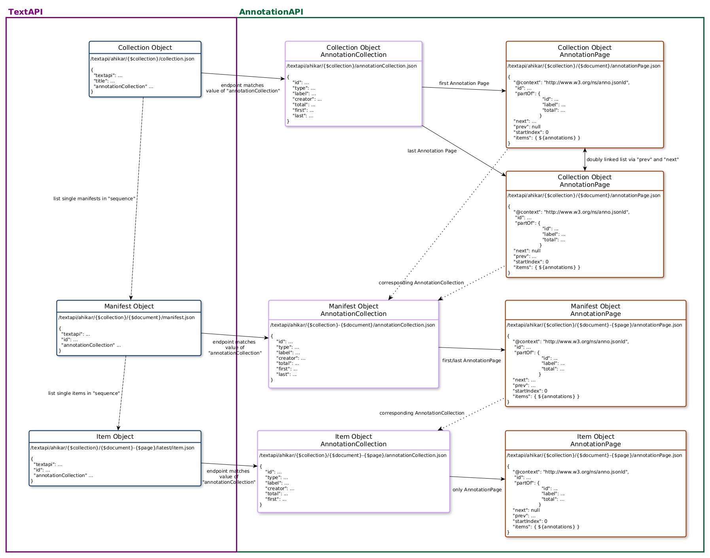

# Ahikar Backend

This aims to serve the complete backend for the Ahikar project.

<!-- START doctoc generated TOC please keep comment here to allow auto update -->
<!-- DON'T EDIT THIS SECTION, INSTEAD RE-RUN doctoc TO UPDATE -->

- [Getting Started](#getting-started)
  - [Prerequisites](#prerequisites)
  - [Build](#build)
    - [eXist-db App and Dependencies](#exist-db-app-and-dependencies)
    - [Get the Frontend](#get-the-frontend)
  - [Environment variables](#environment-variables)
  - [Building All Docker Container Images](#building-all-docker-container-images)
  - [Start the Backend](#start-the-backend)
- [Architecture](#architecture)
  - [Internal Workings of the Backend](#internal-workings-of-the-backend)
- [Connecting the Backend with the Frontend](#connecting-the-backend-with-the-frontend)
- [Tests](#tests)
- [API documentation](#api-documentation)
  - [Interplay of TextAPI and AnnotationAPI](#interplay-of-textapi-and-annotationapi)
- [License](#license)
- [Contributing](#contributing)
- [Versioning](#versioning)
- [Authors](#authors)

<!-- END doctoc generated TOC please keep comment here to allow auto update -->

## Getting Started

### Prerequisites

Please make sure you have the following software installed before building the
backend:

- ant
- Docker
- docker-compose

The following programs/commands are used, but usually preinstalled with your Linux distribution and corresponding shell:

- bash
- curl
- echo
- mv
- rm
- touch
- unzip

### Build

#### eXist-db App and Dependencies

```bash
# load eXist-db dependencies (mainly SADE)
ant -f exist-app/build.xml dependencies

# build eXist-db package for Ahikar
ant -f exist-app/build.xml xar

# optionally in one line
# ant -f exist-app/build.xml dependencies xar
```

#### Get the Frontend

```bash
# as long as the frontend repo is internal set a valid access token
# https://gitlab.gwdg.de/profile/personal_access_tokens
# see https://gitlab.gwdg.de/subugoe/ahiqar/backend/-/issues/4
GITLAB_TOKEN=""
curl --header "PRIVATE-TOKEN: $GITLAB_TOKEN" "https://gitlab.gwdg.de/api/v4/projects/9882/jobs/artifacts/develop/download?job=build" --output frontend.zip
unzip frontend.zip -d docker/frontend
mv docker/frontend/Qviewer/dist/spa/* docker/frontend && rm -rf docker/frontend/Qviewer
```

### Environment variables

To pass credentials to the container, we use the file `ahikar.env` which is not part of this repository. For loading data from TextGrid, this file MUST contain the following parameters:

- TGLOGIN with `username:password`

For local development this file MUST be present but can be left empty. In this case, TextGrid Connect Standalone may be used to import data from TextGrid.

```bash
touch docker/ahikar.env
```

In addition we use a `.env` file for passing parameters to docker-compose and set variables named in the `docker-compose.yml`. The parameters depend on the deployment target and are set by the script.

```bash
./docker/set-env-for-docker-compose.sh
```

`APP_NAME` will be set here as well. This is used to determine the deployed container (docker-compose APP_NAME) but CAN be used to determine the eXist-db application to load in the environment as the app is named in accordance to this value.

### Building All Docker Container Images

```bash
docker-compose --env-file docker/.env --file docker/docker-compose.yml build
```

### Start the Backend

```bash
docker-compose --env-file docker/.env --file docker/docker-compose.yml up --detach
```

## Architecture

### Internal Workings of the Backend



## Connecting the Backend with the Frontend

The corresponding frontend for the Ahiqar backend is [Ahiqar's version of the TIDO viewer](https://gitlab.gwdg.de/subugoe/ahiqar/ahiqar-tido).
In order to connect the back end with the viewer, the former simply has to expose a REST API that complies to the specification of the [SUB's generic TextAPI](https://subugoe.pages.gwdg.de/emo/text-api/).
The specification of the project specific API can be found at the [API's documentation page](https://subugoe.pages.gwdg.de/ahiqar/api-documentation/).

The frontend takes care of the data transfer as described in [TIDO's README](https://gitlab.gwdg.de/subugoe/emo/Qviewer/-/blob/develop/README.md#connecting-the-viewer-with-a-backend).

## Tests

All functions are based on unit tests which are executed automatically as the first stage of this repo's pipelines.

To enable local testing without credentials some tests that require access to TextGrid have been outsourced to separate files in `exist-app/tests`.
These are only executed by the `testtrigger.xqm` module if the respective environment variable, `TGLOGIN` is set in `ahikar.env`.

This way, tests can be executed locally via the API endpoint `/trigger-tests` or the script `tests-runner.xq` without running into authentication problems.

## API documentation

The backend comes shipped with an OpenAPI documentation of its API.
The docs are available at <https://ahikar-dev.sub.uni-goettingen.de/openapi> or at <https://subugoe.pages.gwdg.de/ahiqar/api-documentation/>.

### Interplay of TextAPI and AnnotationAPI



## License

See the [LICENSE file](LICENSE.md) for more information on how to re-use this software.

## Contributing

Please read [CONTRIBUTING.md](CONTRIBUTING.md) for details on our code of conduct, and the process for submitting pull requests to us.

## Versioning

We use [SemVer](https://semver.org/) for versioning. For the versions available, see the [tags on this repository](https://gitlab.gwdg.de/subugoe/ahiqar/backend/-/tags).

## Authors

- [Mathias Göbel](https://gitlab.gwdg.de/mgoebel)
- [Michelle Weidling](https://gitlab.gwdg.de/mrodzis)

See also the list of contributors who participated in this project.
